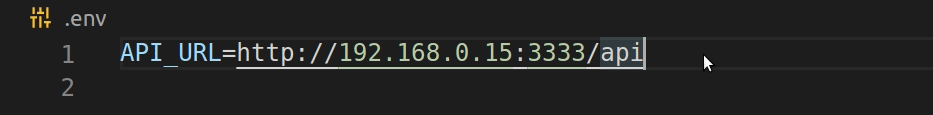

# Rocketshoes (mobile-android)

A Rocketshoes é uma aplicação fictícia de venda de sapatos. A aplicação foi criada para demostrar o uso da arquitetura Flux. Através do uso do Redux e Redux Saga a aplicação controla o carrinho de compras. A arquitetura aplicada é responsável pela adição de uma compra ao carrinho e o cálculo dos valores apresentados.

**A versão web desse projeto pode ser encontrada nesse [link](https://github.com/jozieliosantiago/rocketshoes).**

# Imagens do App
<p align="center">
  
  
  
  
</p>

## Instalação

Como a aplicação foi contruída para fins didáticos o passo a passo abaixo provê a instalação da aplicação em modo de desenvolvimento.

### Servidor

Para executar o projeto é necessário ter o [docker](https://www.docker.com/) instalado. O docker será usado para a execução do servidor da aplicação. O servidor trata-se de um container [node](https://hub.docker.com/_/node/) executando a biblioteca [json-server](https://github.com/typicode/json-server).

Após clonar o projeto, dentro da pasta **docker**, execute o seguinte comando

```bash
docker build -t app-server . && docker run --name rocketshoes-server -p 3333:3333 -it -d app-server
```
Um container será criado com o nome rocketshoes-server e pode ser visto em execusão através do comando
```bash
docker ps
```
### App
<!-- docker stop rocketshoes-server && docker rm rocketshoes-server && docker rmi app-server -->

O passo a passo abaixo mostra como executar a aplicação diretamente no dispositivo móvel, o que não descarta o uso de emuladores. Caso opte pelo uso de emuladores basta seguir as etapas trocando o uso do dispositivo, conectado via USB, pelo emulador escolhido.

Dentro da pasta raíz do projeto execute o comando

```bash
yarn
```
Na pasta raíz do projeto existe um arquivo *.env* com a variável API_URL. Substitua o ip de exemplo do arquivo pelo ip da máquina onde está rodando o container docker criado



## Execução

Conecte o dispositivo Android via USB em modo de Debug. Dentro da pasta do projeto execute
```bash
yarn android
yarn start
```

## Licença
[MIT](https://choosealicense.com/licenses/mit/)
